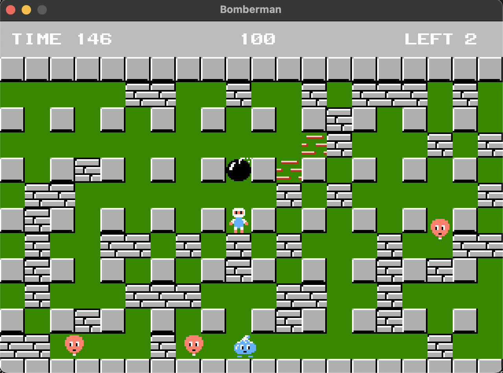

# LÖVE Bomberman
Love Bomberman is a game created using the LÖVE framework. The project is based on the pygame course available on [Udemy](https://www.udemy.com/course/game-dev-bomberman-with-python-pygame-and-oop).
## Screenshot

## Controls
| Key    | Action |
| -------- | ------- |
| left arrow  | left    |
| right arrow | right     |
| up arrow    | up    |
| down arrow  | down    |
| space    | plant bomb    |
| z    | detonate bomb    |
| n    | next level    |
| backspace    | go to title screen    |
| e/enter    | start    |
| escape    | go back    |

## Addons
* [LÖVE](https://love2d.org) framework official website
* [OOO library](https://github.com/rxi/classic)
* [Input library](https://github.com/a327ex/boipushy)
* [Gameplay](https://youtu.be/FhSpUJ5sQGc)
